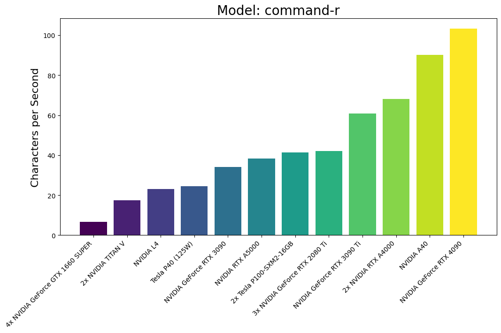
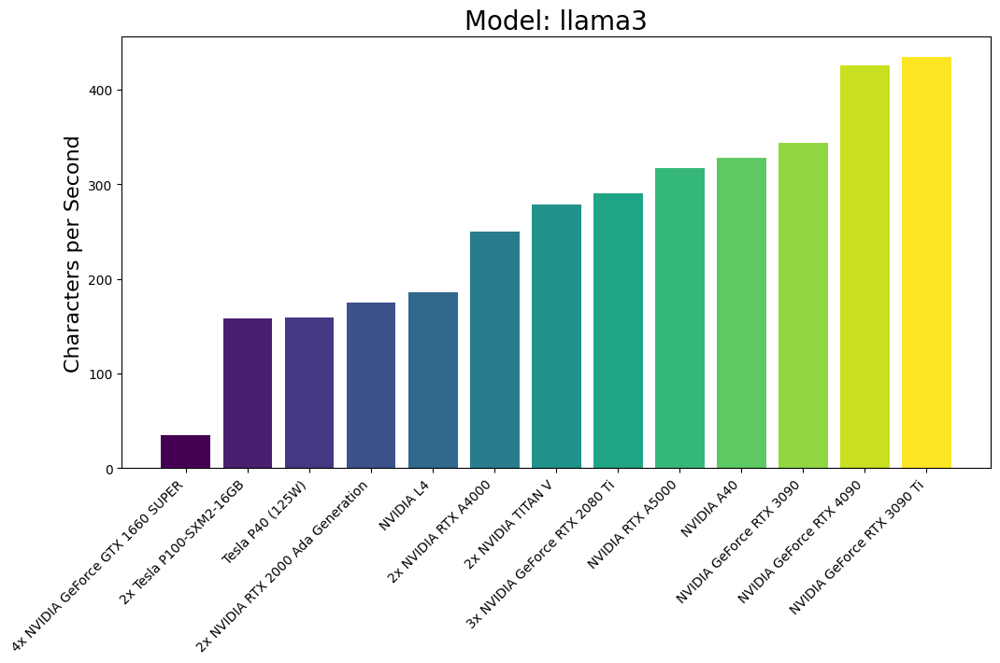
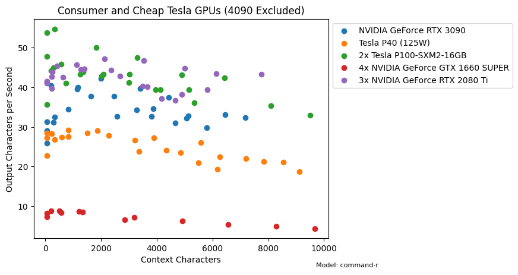
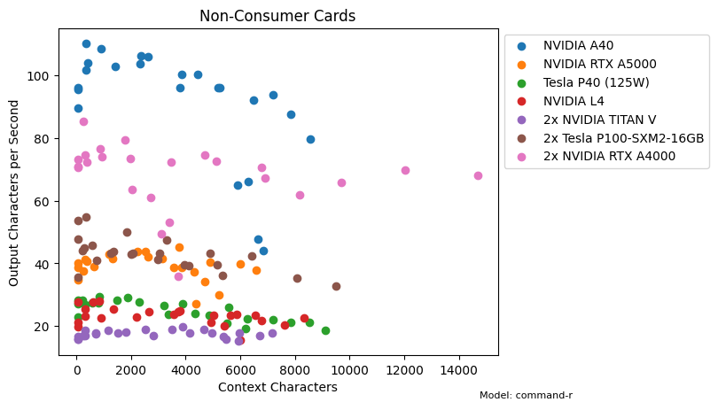
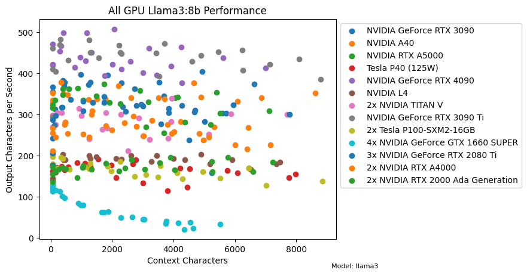
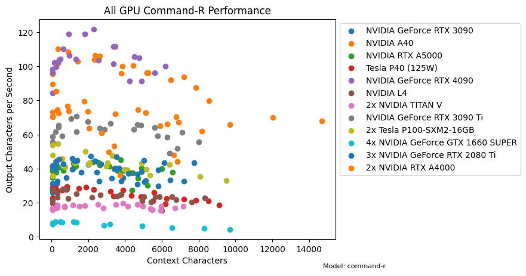
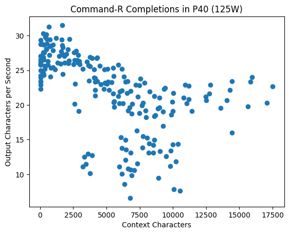

# Ollama GPU Benchmark

The evaluation uses system prompts to instruct two copies of the model to have a conversation with one another. It records the time between making a completion request and recieving the completion, and the length of the completion in characters. While it's less standard to measure characters/second over than tokens/second,breaking with the tokens/second convention makes the benchmark model agnostic. 

I tested two quantized models available from ollama: command-r 35b Q4_0 and llama3 8b Q4_0. I included the former as I use it most for code completions and text formatting as of July 2024, and the latter for its popularity. The raw data can be seen further down, or in the data_analysis directory. 

## GPUs Ranked

The following chart sums things up nicely:

To generate the above charts, I fit a line to the context length to output characters/second graphs for all my collected data and evaluated it at 4000 tokens. Note that I am running the P40 at 125W, as I'm currently waiting on a better cooling solution. 

## More Command-R Data

## Raw Data

#### GPUs compared

#### Extended Data from P40

Here is data from an extended run of 220 completions on my P40. Note that I am running it at 125W while I'm waiting on a better cooling solution. 

I ended the 4x 1660S run early because the container was overpriced and it was taking minutes for each completion, but the full eval ran on all other cards.

## Running the Benchmark

#### Step 0: Setup machine with latest cuda drivers
First, setup machine with the latest cuda drivers (handled by runpod.io and vast.ai where I rented the GPUs). Assuming python runs python3, the run_eval.sh script will download ollama, run the ollama server, and run the evaluation
#### Step 1 if ollama is not installed:

- git clone (this repo)

- cd ollama_benchmark

- pip install -r requirements.txt

- python main.py

#### Step 1 if ollama is not installed:

- git clone (this repo)

- cd ollama_benchmark

- chmod +x run_eval.sh

- ./run_eval.sh

#### Step 2:

- When it's done running, there will be two text files in the ollama_benchmark directory - one for llama3 and one for command-r.

#### Bonus:

- Submit a pr with the new data

Disclaimer: the code in its current state was intentionally written in a hacky way to work on my premature abstraction/optimization/modularizing tendencies. 